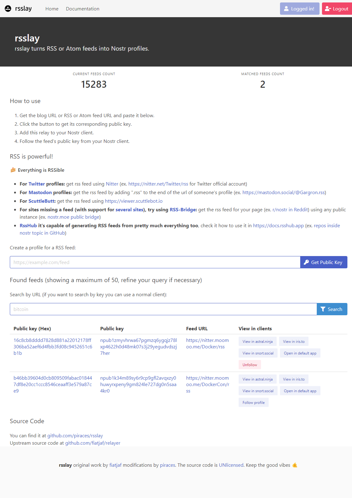

# rsslay

**Nostr relay that creates virtual nostr profiles for each RSS feed submitted** based on [relayer](https://github.com/fiatjaf/relayer/) by [fiatjaf](https://fiatjaf.com).

**Donate for development ⚡:** [https://getalby.com/p/piraces](https://getalby.com/p/piraces)

**Working relay: `wss://rsslay.nostr.moe`. Frontend available in [rsslay.nostr.moe](https://rsslay.nostr.moe).**

## API

`rsslay` exposes an API to work with it programmatically, so you can automate feed creation and retrieval.
Checkout the [wiki entry](https://github.com/piraces/rsslay/wiki/API) for further info.

## Mirroring events ("replaying")

_**Note:** since v0.5.3 its recommended to set `REPLAY_TO_RELAYS` to false. There is no need to perform replays to other relays, the main rsslay should be able to handle the events._

Actually `rsslay` makes usage of a method named `AttemptReplayEvents` which is made to send the events to other relays of confidence to attempt to make the events and the profile more reachable (they are just mirror relays)...

Currently used relays: none.

## Feeds from Twitter via Nitter instances

The [Nitter](https://github.com/zedeus/nitter) project is well integrated into `rsslay` and it performs special handling of this kind of feeds.
Currently `rsslay` is doing the following with Nitter feeds:
- Upgrading to `https` all instances that may be misconfigured.
- Format some responses and retweets in a more "user-friendly" way.
- As there are many instances available out there, if one is unreachable at the moment of parsing, a pool of instances is used (configurable):
  - [birdsite.xanny.family](https://birdsite.xanny.family/)
  - [notabird.site](https://notabird.site/)
  - [nitter.moomoo.me](https://nitter.moomoo.me/)
  - [nitter.fly.dev](https://nitter.fly.dev/)

## Running the project

Running `rsslay` its easy, checkout [the wiki entry for it](https://github.com/piraces/rsslay/wiki/Running-the-project).

## Deploying your instance

If you want to run your own instance, you are covered!
Several options (including "one-click" ones) are available.
Checkout [the wiki](https://github.com/piraces/rsslay/wiki/Deploy-your-own-instance).

## Caching

Since version v0.5.1, rsslay uses cache by default (in-memory with [BigCache](https://github.com/allegro/bigcache) by default or with [Redis](https://redis.io/) if configured) enabled by default to improve performance.
In the case of the main instance `rsslay.nostr.moe`, Redis is used in HA mode to improve performance for multiple requests for the same feed.

**Nevertheless, there is a caveat using this approach that is that cached feeds do not refresh for 30 minutes (but I personally think it is worth for the performance gain).**

## Metrics

Since version v0.5.1, rsslay uses [Prometheus](https://prometheus.io/) instrumenting with metrics exposed on `/metrics` path.
So with this you can mount your own [Graphana](https://grafana.com/) dashboards and look into rsslay insights!

# Related projects

- **atomstr** by [@psic4t](https://github.com/psic4t): atomstr is a RSS/Atom gateway to Nostr. It fetches all sorts of RSS or Atom feeds, generates Nostr profiles for each and posts new entries to given Nostr relay(s). If you have one of these relays in your profile, you can find and subscribe to the feeds.
  - Source code: https://sr.ht/~psic4t/atomstr/
  - Demo instance: https://atomstr.data.haus/

# Contributing

Feel free to [open an issue](https://github.com/piraces/rsslay/issues/new), provide feedback in [discussions](https://github.com/piraces/rsslay/discussions), or fork the repo and open a PR with your contribution!

**All kinds of contributions are welcome!**

# Contact

You can reach me on nostr [`npub1ftpy6thgy2354xypal6jd0m37wtsgsvcxljvzje5vskc9cg3a5usexrrtq`](https://snort.social/p/npub1ftpy6thgy2354xypal6jd0m37wtsgsvcxljvzje5vskc9cg3a5usexrrtq)

Also on [the bird site](https://twitter.com/piraces_), and [Mastodon](https://hachyderm.io/@piraces).

# License

[Unlicense](https://unlicense.org).

